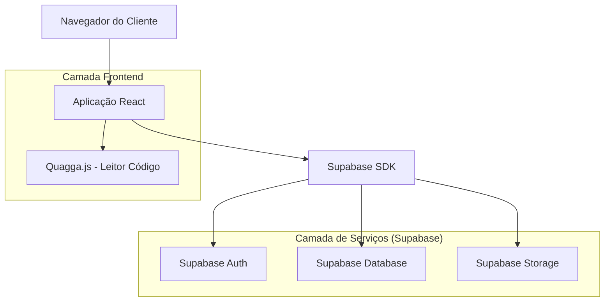
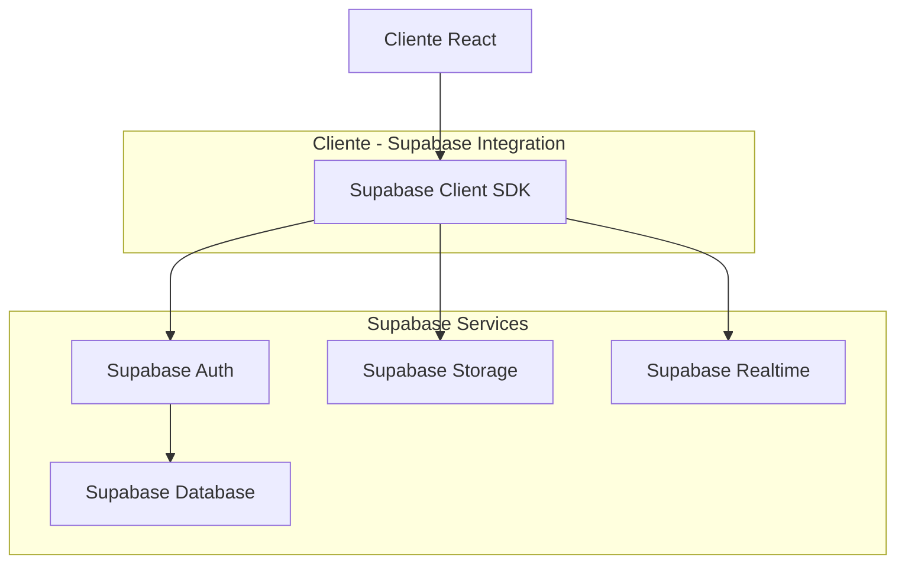
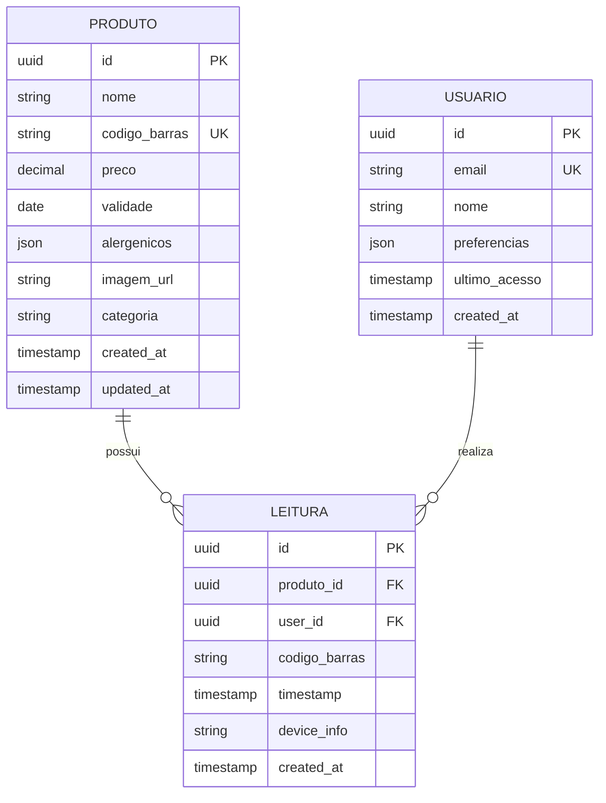

## 1. Arquitetura do Sistema



## 2. Descrição das Tecnologias

* **Frontend**: React\@18 + TypeScript + TailwindCSS\@3 + Vite

* **Ferramenta de Inicialização**: vite-init

* **Backend**: Supabase (BaaS)

* **Biblioteca de Leitura**: QuaggaJS\@1.4.2

* **Gerenciamento de Estado**: React Context API

* **Tipagem**: TypeScript\@5

## 3. Definições de Rotas

| Rota                   | Finalidade                                                                         |
| ---------------------- | ---------------------------------------------------------------------------------- |
| /                      | Tela inicial com instruções e botão para iniciar leitura                           |
| /scanner               | Interface de leitura com câmera ativada                                            |
| /produto/:codigoBarras | Exibição de informações do produto encontrado                                      |
| /erro/:tipoErro        | Tela de erro específica (camera-negada/produto-nao-encontrado/camera-indisponivel) |
| /busca-manual          | Formulário para entrada manual de código de barras                                 |
| /ajuda                 | Instruções detalhadas de uso do leitor                                             |

## 4. Definições de API

### 4.1 APIs do Supabase

**Buscar Produto por Código de Barras**

```
GET /rest/v1/produtos?codigo_barras=eq.{codigo}
```

Headers:

| Nome do Parâmetro | Tipo   | Obrigatório | Descrição                |
| ----------------- | ------ | ----------- | ------------------------ |
| apikey            | string | sim         | Chave de API do Supabase |
| Authorization     | string | sim         | Bearer token JWT         |

Response:

```json
{
  "id": "uuid",
  "nome": "Produto Exemplo",
  "codigo_barras": "7891234567890",
  "preco": 15.99,
  "validade": "2024-12-31",
  "alergenicos": ["gluten", "lactose"],
  "imagem_url": "https://...",
  "categoria": "alimentos",
  "created_at": "2024-01-01T00:00:00Z"
}
```

**Buscar Histórico de Leituras**

```
GET /rest/v1/leituras?user_id=eq.{userId}&order=created_at.desc
```

**Registrar Leitura**

```
POST /rest/v1/leituras
```

Request:

```json
{
  "produto_id": "uuid",
  "codigo_barras": "7891234567890",
  "user_id": "uuid",
  "timestamp": "2024-12-08T10:30:00Z"
}
```

## 5. Arquitetura do Servidor



## 6. Modelo de Dados

### 6.1 Definição do Modelo de Dados



### 6.2 Linguagem de Definição de Dados (DDL)

**Tabela de Produtos (produtos)**

```sql
-- criar tabela
CREATE TABLE produtos (
    id UUID PRIMARY KEY DEFAULT gen_random_uuid(),
    nome VARCHAR(255) NOT NULL,
    codigo_barras VARCHAR(20) UNIQUE NOT NULL,
    preco DECIMAL(10,2) NOT NULL,
    validade DATE,
    alergenicos JSONB DEFAULT '[]',
    imagem_url TEXT,
    categoria VARCHAR(100),
    created_at TIMESTAMP WITH TIME ZONE DEFAULT NOW(),
    updated_at TIMESTAMP WITH TIME ZONE DEFAULT NOW()
);

-- criar índices
CREATE INDEX idx_produtos_codigo_barras ON produtos(codigo_barras);
CREATE INDEX idx_produtos_categoria ON produtos(categoria);
CREATE INDEX idx_produtos_nome ON produtos(nome);

-- políticas de segurança RLS
ALTER TABLE produtos ENABLE ROW LEVEL SECURITY;

-- permissões para usuários anônimos (leitura)
CREATE POLICY "Permitir leitura pública de produtos" ON produtos
    FOR SELECT USING (true);

-- permissões para usuários autenticados (leitura)
CREATE POLICY "Permitir leitura total de produtos" ON produtos
    FOR SELECT TO authenticated USING (true);
```

**Tabela de Leituras (leituras)**

```sql
-- criar tabela
CREATE TABLE leituras (
    id UUID PRIMARY KEY DEFAULT gen_random_uuid(),
    produto_id UUID REFERENCES produtos(id) ON DELETE CASCADE,
    user_id UUID REFERENCES auth.users(id) ON DELETE CASCADE,
    codigo_barras VARCHAR(20) NOT NULL,
    timestamp TIMESTAMP WITH TIME ZONE DEFAULT NOW(),
    device_info JSONB DEFAULT '{}',
    created_at TIMESTAMP WITH TIME ZONE DEFAULT NOW()
);

-- criar índices
CREATE INDEX idx_leituras_user_id ON leituras(user_id);
CREATE INDEX idx_leituras_produto_id ON leituras(produto_id);
CREATE INDEX idx_leituras_timestamp ON leituras(timestamp DESC);
CREATE INDEX idx_leituras_codigo_barras ON leituras(codigo_barras);

-- políticas de segurança RLS
ALTER TABLE leituras ENABLE ROW LEVEL SECURITY;

-- permissões para usuários autenticados (CRUD próprio)
CREATE POLICY "Usuários podem ver próprias leituras" ON leituras
    FOR SELECT TO authenticated USING (auth.uid() = user_id);

CREATE POLICY "Usuários podem criar leituras" ON leituras
    FOR INSERT TO authenticated WITH CHECK (auth.uid() = user_id);
```

**Dados Iniciais de Exemplo**

```sql
-- inserir produtos de exemplo
INSERT INTO produtos (nome, codigo_barras, preco, validade, alergenicos, categoria) VALUES
('Arroz Integral 1kg', '7891234567890', 8.99, '2025-12-31', '[]', 'grãos'),
('Leite Integral 1L', '7891234567891', 4.50, '2024-12-25', '["lactose"]', 'laticínios'),
('Pão de Forma Integral', '7891234567892', 6.75, '2024-12-15', '["gluten"]', 'padaria'),
('Barrinha de Cereal', '7891234567893', 2.30, '2024-11-30', '["gluten", "amendoim"]', 'snacks'),
('Iogurte Natural 200g', '7891234567894', 3.20, '2024-12-20', '["lactose"]', 'laticínios');

-- conceder permissões
GRANT SELECT ON produtos TO anon;
GRANT ALL PRIVILEGES ON produtos TO authenticated;
GRANT SELECT ON leituras TO authenticated;
GRANT ALL PRIVILEGES ON leituras TO authenticated;
```

## 7. Configuração do Supabase

### 7.1 Configurações de Autenticação

* Métodos de autenticação: Email/Password, Google OAuth, Apple OAuth

* Políticas de senha: Mínimo 8 caracteres, maiúsculas, minúsculas e números

* Sessões: JWT com expiração de 1 hora, refresh tokens de 7 dias

### 7.2 Configurações de Storage

* Bucket 'produtos-imagens': Para armazenar imagens dos produtos

* Políticas de acesso: Leitura pública, escrita apenas autenticada

* Limites: Máximo 5MB por imagem, formatos permitidos: jpg, png, webp

### 7.3 Configurações de API

* Rate limiting: 100 requisições por minuto por IP

* CORS: Permitir apenas origens especificadas do domínio da aplicação

* Timeout: 30 segundos para requisições de leitura de código de barras

