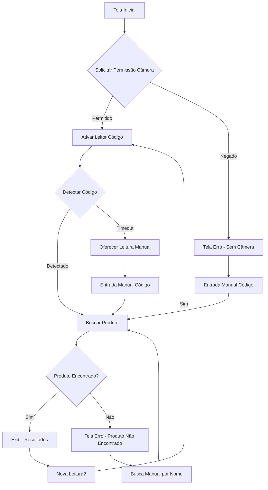

## 1. Visão Geral do Produto

Tela de experiência interativa para auxiliar clientes durante as compras, permitindo leitura de código de barras via câmera do dispositivo móvel para obter informações instantâneas sobre produtos.

Problema a resolver: Clientes precisam de acesso rápido a informações de produtos (preço, validade, alergênicos) sem procurar manualmente.
Público-alvo: Clientes de estabelecimentos comerciais durante o processo de compra.
Valor de mercado: Melhoria na experiência de compra, redução de tempo de busca por informações, aumento da satisfação do cliente.

## 2. Funcionalidades Principais

### 2.1 Papéis de Usuário
| Papel | Método de Acesso | Permissões Principais |
|------|-------------------|----------------------|
| Cliente | Acesso direto via navegador | Ler código de barras, visualizar informações de produtos |
| Visitante | Acesso direto sem cadastro | Funcionalidade limitada de leitura e visualização |

### 2.2 Módulo de Funcionalidades

Nossa tela de experiência consiste nos seguintes módulos principais:

1. **Tela de Leitura**: Interface com câmera ativada, botão de captura, área de visualização do código detectado.
2. **Tela de Resultados**: Exibição de informações do produto (preço, validade, alergênicos), opções de ações adicionais.
3. **Tela de Erro**: Mensagens de erro amigáveis, sugestões de ação, botão para tentar novamente.

### 2.3 Detalhes das Páginas

| Nome da Página | Módulo | Descrição da Funcionalidade |
|----------------|---------|----------------------------|
| Tela de Leitura | Leitor de Código | Ativar câmera do dispositivo, detectar código de barras automaticamente usando Quagga.js, exibir indicador visual de detecção, permitir leitura manual caso automática falhe. |
| Tela de Leitura | Interface da Câmera | Exibir preview em tempo real, destacar área de foco para código de barras, botão de captura manual, indicador de status (detectando/lendo/processando). |
| Tela de Resultados | Informações do Produto | Exibir nome do produto, preço atual, data de validade, lista de alergênicos em destaque visual, imagem do produto se disponível. |
| Tela de Resultados | Ações do Usuário | Botão para nova leitura, compartilhar informações, adicionar a lista de compras, reportar erro no produto. |
| Tela de Erro | Mensagens de Erro | Exibir erro amigável quando código não encontrado, quando câmera não disponível, quando produto não cadastrado, com sugestões de ação. |
| Tela de Erro | Ações de Recuperação | Botão "Tentar Novamente", link para busca manual por nome, instruções de uso do leitor, contato com suporte. |

## 3. Fluxo Principal

### Fluxo do Cliente
1. Usuário acessa a tela de experiência
2. Sistema solicita permissão para usar câmera
3. Câmera é ativada com interface de leitura
4. Usuário posiciona código de barras na área de foco
5. Sistema detecta e lê o código automaticamente
6. Busca informações do produto no banco de dados
7. Exibe tela de resultados com informações completas
8. Usuário pode fazer nova leitura ou explorar outras ações

### Fluxo de Erro
1. Se código não detectado em 30 segundos → Oferecer leitura manual
2. Se produto não encontrado → Mensagem amigável com sugestão de busca manual
3. Se câmera indisponível → Oferecer entrada manual do código
4. Se erro de conexão → Mensagem com opção de tentar novamente

## 4. Design da Interface

### 4.1 Estilo de Design
- **Cores Primárias**: Verde #4CAF50 (confiança, saúde), Branco #FFFFFF (limpeza)
- **Cores Secundárias**: Cinza #757575 (texto), Vermelho #F44336 (alergênicos/erros)
- **Estilo de Botões**: Arredondados com sombra suave, tamanhos adaptáveis para touch
- **Tipografia**: Fonte sans-serif moderna (Roboto/Open Sans), tamanhos 16px+ para mobile
- **Layout**: Card-based com áreas de foco claras, navegação minimalista
- **Ícones**: Estilo outline, cores monocromáticas com destaques em situações especiais

### 4.2 Visão Geral das Páginas

| Nome da Página | Módulo | Elementos de UI |
|----------------|---------|----------------|
| Tela de Leitura | Área da Câmera | Preview em tempo real ocupando 70% da tela, borda de foco com animação pulsante, overlay com instruções "Posicione o código de barras aqui" |
| Tela de Leitura | Indicadores | Barra de status superior mostrando "Detectando...", ícone de câmera ativa, botão de captura manual estilo FAB (Floating Action Button) |
| Tela de Resultados | Card Principal | Card expansivo com imagem do produto, nome em fonte 24px negrito, preço destacado em verde com fonte 32px |
| Tela de Resultados | Informações Críticas | Seção de validade com ícone de calendário em laranja, lista de alergênicos em vermelho com ícones de alerta, badges visuais para destaque |
| Tela de Erro | Mensagem Amigável | Ilustração animada representando o erro, texto explicativo em linguagem simples, sugestões de ação em bullet points |
| Tela de Erro | Ações de Recuperação | Botão primário grande "Tentar Novamente", link secundário para busca manual, botão de ajuda com tooltip informativo |

### 4.3 Responsividade
- **Desktop-first**: Interface otimizada para tablets e smartphones
- **Mobile-adaptive**: Layout se adapta para telas de 320px até 1200px
- **Touch optimization**: Botões mínimos 48px, áreas de toque ampliadas, gestos de swipe para navegação
- **Orientação**: Suporte para portrait e landscape, com adaptação automática da interface