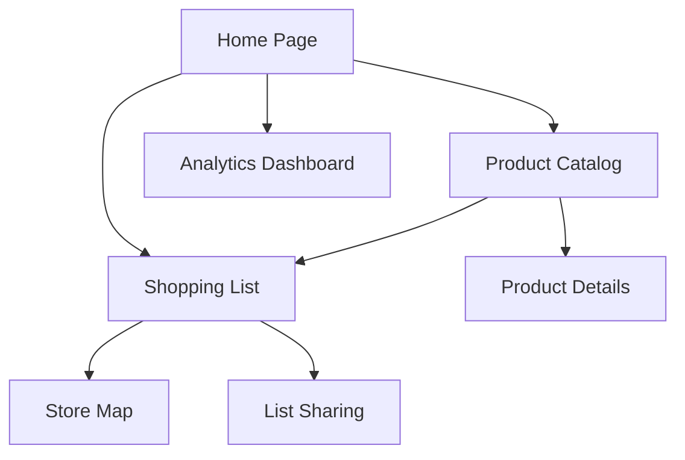

## 1. Product Overview
Supermarket shopping assistant app that provides a modern, easy and intelligent shopping journey for customers using simple and low-investment technology. The solution helps supermarkets reduce queues, increase average ticket value, and gain competitive advantage while providing customers with organized shopping experiences.

Target market: Local supermarkets seeking digital transformation with minimal investment.

## 2. Core Features

### 2.1 User Roles
| Role | Registration Method | Core Permissions |
|------|---------------------|------------------|
| Customer | Phone number registration | Create shopping lists, browse products, view store map |
| Store Manager | Admin invitation | Manage products, view analytics, update store information |
| Store Staff | Manager assignment | Assist customers, manage inventory |

### 2.2 Feature Module
Our supermarket shopping assistant consists of the following main pages:
1. **Home page**: Store selection, featured products, quick access to lists
2. **Product catalog**: Browse products by department, search and filter
3. **Shopping list**: Create and manage lists, calculate total cost
4. **Store map**: Interactive map showing product locations
5. **Analytics dashboard**: View shopping metrics and insights

### 2.3 Page Details
| Page Name | Module Name | Feature description |
|-----------|-------------|---------------------|
| Home page | Store selection | Choose supermarket location, view opening hours and contact info |
| Home page | Featured products | Display promotional items and daily offers |
| Home page | Quick lists | Access recent shopping lists and create new ones |
| Product catalog | Department browsing | Navigate products organized by store sections (dairy, produce, etc.) |
| Product catalog | Search and filter | Find products by name, brand, or dietary restrictions |
| Product catalog | Product details | View price, nutritional info, availability status |
| Shopping list | List creation | Add products, set quantities, organize by department |
| Shopping list | Cost calculator | Real-time total calculation with automatic price updates |
| Shopping list | Sharing | Share lists with family members or friends |
| Store map | Interactive layout | Visual store map with product location indicators |
| Store map | Navigation guide | Optimal route suggestion based on shopping list |
| Analytics dashboard | Basic metrics | View most searched items, average shopping time, abandoned items |
| Analytics dashboard | Reports | Generate daily/weekly/monthly shopping behavior reports |

## 3. Core Process

### Customer Flow
1. User opens app and selects preferred supermarket location
2. Browses products by department or searches for specific items
3. Creates shopping list by adding products with quantities
4. Views real-time total cost with automatic price updates
5. Accesses store map to see optimal shopping route
6. Completes in-store shopping following the organized list

### Store Manager Flow
1. Manager logs into admin panel
2. Updates product catalog with prices and availability
3. Reviews analytics dashboard for shopping insights
4. Adjusts store layout based on customer behavior data
5. Monitors popular products and inventory needs

## 4. User Interface Design

### 4.1 Design Style
- **Primary color**: Fresh green (#4CAF50) representing freshness and sustainability
- **Secondary color**: Clean white (#FFFFFF) with light gray (#F5F5F5) backgrounds
- **Button style**: Rounded corners with subtle shadows, primary actions in green
- **Font**: Clean sans-serif (Roboto/Inter), 16px base size for readability
- **Layout**: Card-based design with clear visual hierarchy
- **Icons**: Material Design icons for consistency and recognition

### 4.2 Page Design Overview
| Page Name | Module Name | UI Elements |
|-----------|-------------|-------------|
| Home page | Store selection | Card-based store cards with photos, hours, distance indicator |
| Home page | Featured products | Horizontal scrollable cards with product images and prices |
| Product catalog | Department grid | Icon-based grid layout, color-coded by department |
| Product catalog | Search results | Vertical list with product thumbnails, prices, add-to-list buttons |
| Shopping list | List view | Grouped by department, checkbox items, running total at bottom |
| Store map | Interactive map | Color-coded departments, numbered aisles, user location marker |
| Analytics dashboard | Metrics cards | KPI cards with trending indicators, simple bar charts |

### 4.3 Responsiveness
Desktop-first design approach with mobile adaptation. Touch-optimized interface for in-store use, with larger touch targets and swipe gestures for product browsing and list management.