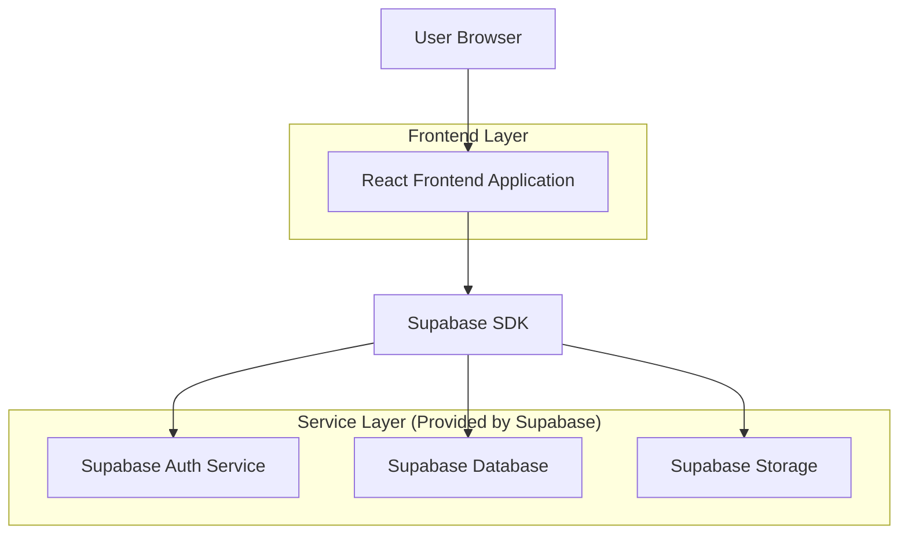
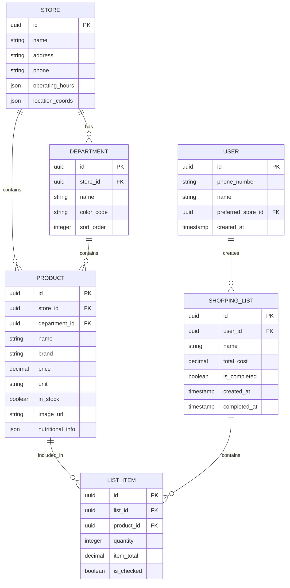

## 1. Architecture design



## 2. Technology Description
- Frontend: React@18 + tailwindcss@3 + vite
- Backend: Supabase (BaaS)
- Database: PostgreSQL (via Supabase)
- Authentication: Supabase Auth
- Storage: Supabase Storage for product images

## 3. Route definitions
| Route | Purpose |
|-------|---------|
| / | Home page with store selection and featured products |
| /catalog | Product catalog with department browsing |
| /products/:id | Individual product details page |
| /lists | Shopping list management and creation |
| /lists/:id | Specific shopping list view and edit |
| /map | Interactive store map |
| /admin | Analytics dashboard for store managers |
| /admin/products | Product management interface |
| /auth/login | User authentication page |
| /auth/register | User registration page |

## 4. API definitions

### 4.1 Core API

Product catalog operations
```
GET /api/products
```

Request:
| Param Name| Param Type  | isRequired  | Description |
|-----------|-------------|-------------|-------------|
| department | string      | false       | Filter by store department |
| search     | string      | false       | Search term for product name |
| page       | number      | false       | Pagination page number |
| limit      | number      | false       | Items per page |

Response:
| Param Name| Param Type  | Description |
|-----------|-------------|-------------|
| products  | array       | Array of product objects |
| total     | number      | Total count of products |

Shopping list operations
```
POST /api/lists
```

Request:
| Param Name| Param Type  | isRequired  | Description |
|-----------|-------------|-------------|-------------|
| name      | string      | true        | List name |
| items     | array       | true        | Array of product items with quantities |

Response:
| Param Name| Param Type  | Description |
|-----------|-------------|-------------|
| id        | string      | Created list ID |
| total     | number      | Calculated total cost |

## 5. Server architecture diagram
Not applicable - using Supabase BaaS architecture with direct client-side integration.

## 6. Data model

### 6.1 Data model definition


### 6.2 Data Definition Language

Store Table
```sql
CREATE TABLE stores (
    id UUID PRIMARY KEY DEFAULT gen_random_uuid(),
    name VARCHAR(255) NOT NULL,
    address TEXT NOT NULL,
    phone VARCHAR(20),
    operating_hours JSONB,
    location_coords JSONB,
    created_at TIMESTAMP WITH TIME ZONE DEFAULT NOW()
);

-- Grant permissions
GRANT SELECT ON stores TO anon;
GRANT ALL PRIVILEGES ON stores TO authenticated;
```

Department Table
```sql
CREATE TABLE departments (
    id UUID PRIMARY KEY DEFAULT gen_random_uuid(),
    store_id UUID REFERENCES stores(id) ON DELETE CASCADE,
    name VARCHAR(100) NOT NULL,
    color_code VARCHAR(7) DEFAULT '#4CAF50',
    sort_order INTEGER DEFAULT 0,
    created_at TIMESTAMP WITH TIME ZONE DEFAULT NOW()
);

-- Grant permissions
GRANT SELECT ON departments TO anon;
GRANT ALL PRIVILEGES ON departments TO authenticated;
```

Product Table
```sql
CREATE TABLE products (
    id UUID PRIMARY KEY DEFAULT gen_random_uuid(),
    store_id UUID REFERENCES stores(id) ON DELETE CASCADE,
    department_id UUID REFERENCES departments(id) ON DELETE SET NULL,
    name VARCHAR(255) NOT NULL,
    brand VARCHAR(100),
    price DECIMAL(10,2) NOT NULL,
    unit VARCHAR(20),
    in_stock BOOLEAN DEFAULT true,
    image_url TEXT,
    nutritional_info JSONB,
    created_at TIMESTAMP WITH TIME ZONE DEFAULT NOW(),
    updated_at TIMESTAMP WITH TIME ZONE DEFAULT NOW()
);

-- Grant permissions
GRANT SELECT ON products TO anon;
GRANT ALL PRIVILEGES ON products TO authenticated;

-- Create indexes
CREATE INDEX idx_products_store_id ON products(store_id);
CREATE INDEX idx_products_department_id ON products(department_id);
CREATE INDEX idx_products_name ON products(name);
```

User Table
```sql
CREATE TABLE users (
    id UUID PRIMARY KEY DEFAULT gen_random_uuid(),
    phone_number VARCHAR(20) UNIQUE NOT NULL,
    name VARCHAR(100) NOT NULL,
    preferred_store_id UUID REFERENCES stores(id),
    created_at TIMESTAMP WITH TIME ZONE DEFAULT NOW()
);

-- Grant permissions
GRANT SELECT ON users TO anon;
GRANT ALL PRIVILEGES ON users TO authenticated;
```

Shopping List Table
```sql
CREATE TABLE shopping_lists (
    id UUID PRIMARY KEY DEFAULT gen_random_uuid(),
    user_id UUID REFERENCES users(id) ON DELETE CASCADE,
    name VARCHAR(255) NOT NULL,
    total_cost DECIMAL(10,2) DEFAULT 0,
    is_completed BOOLEAN DEFAULT false,
    created_at TIMESTAMP WITH TIME ZONE DEFAULT NOW(),
    completed_at TIMESTAMP WITH TIME ZONE
);

-- Grant permissions
GRANT SELECT ON shopping_lists TO anon;
GRANT ALL PRIVILEGES ON shopping_lists TO authenticated;

-- Create indexes
CREATE INDEX idx_shopping_lists_user_id ON shopping_lists(user_id);
CREATE INDEX idx_shopping_lists_created_at ON shopping_lists(created_at DESC);
```

List Items Table
```sql
CREATE TABLE list_items (
    id UUID PRIMARY KEY DEFAULT gen_random_uuid(),
    list_id UUID REFERENCES shopping_lists(id) ON DELETE CASCADE,
    product_id UUID REFERENCES products(id) ON DELETE CASCADE,
    quantity INTEGER DEFAULT 1,
    item_total DECIMAL(10,2) DEFAULT 0,
    is_checked BOOLEAN DEFAULT false,
    created_at TIMESTAMP WITH TIME ZONE DEFAULT NOW()
);

-- Grant permissions
GRANT SELECT ON list_items TO anon;
GRANT ALL PRIVILEGES ON list_items TO authenticated;

-- Create indexes
CREATE INDEX idx_list_items_list_id ON list_items(list_id);
CREATE INDEX idx_list_items_product_id ON list_items(product_id);
```